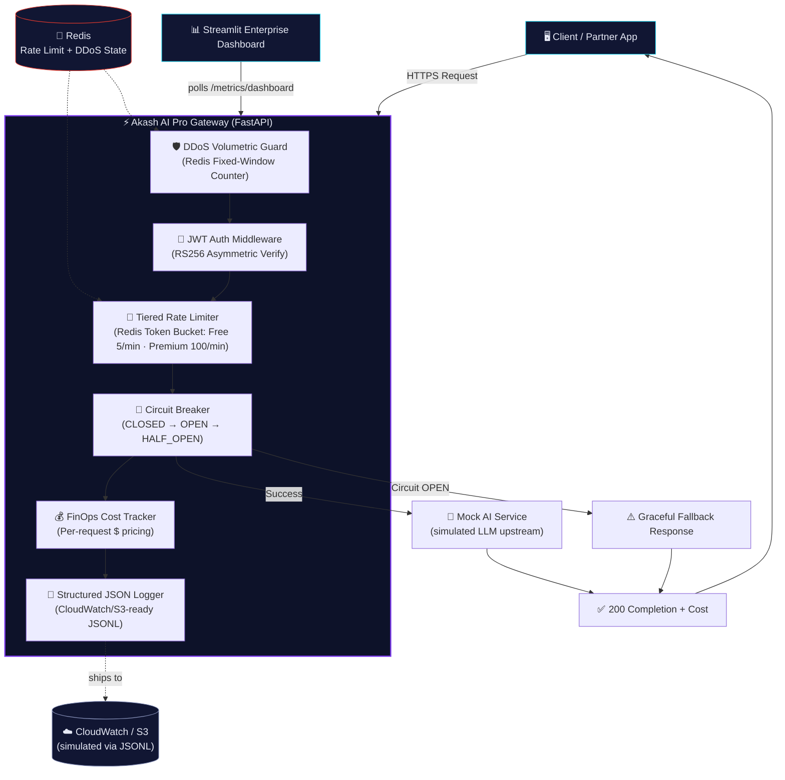
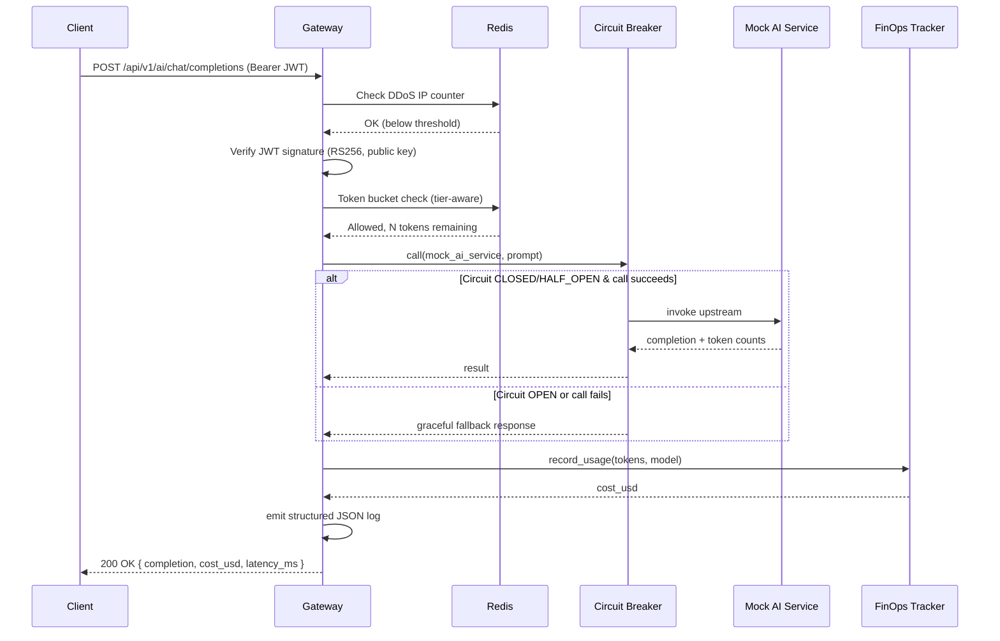

# ⚡ Akash AI Pro — Secure Enterprise API Gateway

**A production-grade, resilience-first AI API Gateway** — asymmetric JWT auth, tiered Redis token-bucket rate limiting, DDoS protection, circuit-breaker resilience, and real-time FinOps AI cost tracking, wrapped in a glowing dark-mode enterprise dashboard.

<p align="left">
  
  
  
  
  
</p>

---

## 📌 Why This Project Exists

Every team exposing an LLM behind an API eventually hits the same four walls:

| Problem | Consequence if ignored |
|---|---|
| No auth boundary | Anyone can hit your endpoint and run up your bill |
| No rate limiting | One noisy client starves everyone else |
| No resilience pattern | A flaky upstream AI provider cascades into a full outage |
| No cost visibility | You find out about the $40k bill *after* the invoice, not during the spike |

**Akash AI Pro** is a reference implementation that solves all four at the gateway layer — the earliest, cheapest point to catch them — before a single token reaches (or fails to reach) your actual AI provider.

---

## 🏗️ System Architecture



### Request Lifecycle (Sequence)



---

## 🧰 Tech Stack Matrix

| Layer | Technology | Why This Choice |
|---|---|---|
| **API Framework** | FastAPI + Uvicorn | Native async, automatic OpenAPI docs, Pydantic-native validation |
| **Validation** | Pydantic v2 | Fast (Rust core), strict typing, first-class FastAPI integration |
| **Auth** | PyJWT (RS256) + passlib/bcrypt | Asymmetric signing decouples "who can verify" from "who can mint" |
| **Rate Limiting** | Redis 7 (async) + Lua token bucket | Atomic, fleet-wide-consistent, burst-tolerant algorithm |
| **Resilience** | Custom Circuit Breaker (CLOSED/OPEN/HALF_OPEN) | Fails fast, protects both caller latency & downstream recovery |
| **FinOps** | Custom Cost Tracker + JSONL ledger | Per-request $ attribution at the earliest observability point |
| **Logging** | Structured JSON (JSONL) | Native CloudWatch Logs Insights / Datadog / ELK ingestion |
| **Dashboard** | Streamlit + Plotly | Data-dense operator cockpit, shipped fast, dark-themed |
| **Containerization** | Docker + docker-compose | 1-command reproducible local & CI environments |
| **CI/CD** | GitHub Actions | Lint → Test → Build → Deploy, fully automated |

---

## 📁 File Structure

```
akash-ai-gateway/
├── .github/
│   └── workflows/
│       └── ci.yml                  # Lint → Test → Build → Deploy pipeline
├── src/
│   ├── main.py                     # FastAPI app: CORS, routers, exception handlers
│   ├── core/
│   │   ├── config.py                # Centralized pydantic-settings configuration
│   │   ├── security.py              # RS256 JWT issuance/verification, bcrypt hashing
│   │   └── logger.py                # Structured JSON (CloudWatch-ready) logging
│   ├── middleware/
│   │   └── rate_limiter.py          # Redis token-bucket limiter + DDoS IP guard
│   ├── services/
│   │   ├── circuit_breaker.py       # CLOSED/OPEN/HALF_OPEN resilience pattern
│   │   ├── cost_tracker.py          # FinOps: per-request token $ pricing + ledger
│   │   └── mock_ai_service.py       # Simulated upstream LLM w/ latency & failures
│   ├── api/
│   │   └── routes.py                # /auth/login, /ai/chat/completions, /health, /metrics
│   └── models/
│       └── schemas.py               # Pydantic v2 request/response contracts
├── dashboard/
│   └── app.py                       # Streamlit dark-themed Enterprise Dashboard
├── tests/
│   └── test_api.py                  # Auth, rate limit, circuit breaker, FinOps tests
├── keys/                             # Auto-generated RSA keypair (gitignored)
├── logs/                             # JSONL structured logs + cost ledger (gitignored)
├── Dockerfile                        # Backend image (multi-stage, non-root)
├── Dockerfile.dashboard              # Dashboard image
├── docker-compose.yml                # 1-click: API + Redis + Dashboard
├── requirements.txt
├── pytest.ini
├── .env.example
└── README.md
```

---

## 🚀 Quick Start

### Option A — Docker Compose (recommended, 1 command)

```bash
git clone https://github.com/<your-org>/akash-ai-gateway.git
cd akash-ai-gateway
docker-compose up --build
```

| Service | URL |
|---|---|
| 🔗 API + Swagger Docs | http://localhost:8000/docs |
| 📊 Enterprise Dashboard | http://localhost:8501 |
| 🧠 Redis | localhost:6379 |

### Option B — Local Development

```bash
python -m venv venv && source venv/bin/activate
pip install -r requirements.txt

# Terminal 1: start Redis (or use docker run -p 6379:6379 redis:7.2-alpine)
redis-server

# Terminal 2: start the API
uvicorn src.main:app --reload

# Terminal 3: start the dashboard
streamlit run dashboard/app.py
```

### Demo Credentials

| Username | Password | Tier | Rate Limit |
|---|---|---|---|
| `free_user` | `FreeUserPass123!` | Free | 5 req/min |
| `premium_user` | `PremiumPass123!` | Premium | 100 req/min |
| `admin` | `AdminPass123!` | Admin | 200 req/min |

### Try It

```bash
# 1. Log in and grab a token
TOKEN=$(curl -s -X POST http://localhost:8000/api/v1/auth/login \
  -H "Content-Type: application/json" \
  -d '{"username":"premium_user","password":"PremiumPass123!"}' | jq -r .access_token)

# 2. Call the protected AI endpoint
curl -X POST http://localhost:8000/api/v1/ai/chat/completions \
  -H "Authorization: Bearer $TOKEN" \
  -H "Content-Type: application/json" \
  -d '{"prompt":"Summarize our Q3 architecture review","model":"akash-llm-pro-1"}'
```

---

## 🔐 Security Design Decisions

- **RS256 over HS256** — the private signing key never leaves the gateway; any number of downstream services can verify tokens with only the public key.
- **Fail-open rate limiting, fail-closed auth** — a Redis outage degrades rate-limiting gracefully (logged, not silently) while auth failures are always hard-rejected.
- **Uniform error envelope** — every 401/422/429/500 returns the same JSON shape, so client SDKs need one error-handling path, not five.
- **Non-root containers** — both Docker images run as an unprivileged `akash` user.
- **No plaintext secrets** — even the in-memory demo user store stores bcrypt hashes, never raw passwords.

## 🧪 Testing

```bash
pytest tests/ -v --cov=src --cov-report=term-missing
```

Covers password hashing, JWT lifecycle (issue/verify/tamper), login success/failure, protected-route access control, full circuit breaker state machine transitions, and FinOps cost-tracker pricing math + crash-safe ledger replay.

## 📈 Roadmap

- [ ] Swap in-memory user store for a real IdP (Cognito/Auth0)
- [ ] Ship structured logs to real AWS CloudWatch via `boto3`
- [ ] Add OpenTelemetry distributed tracing across the request lifecycle
- [ ] Per-tenant cost budgets with automatic throttling on overage

---

<p align="center"><i>Built as Project 2 of the Enterprise AI Portfolio — architected for FAANG-scale reliability, security, and cost discipline.</i></p>
